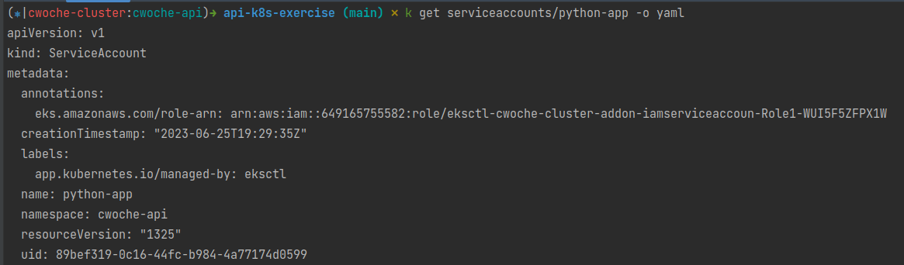
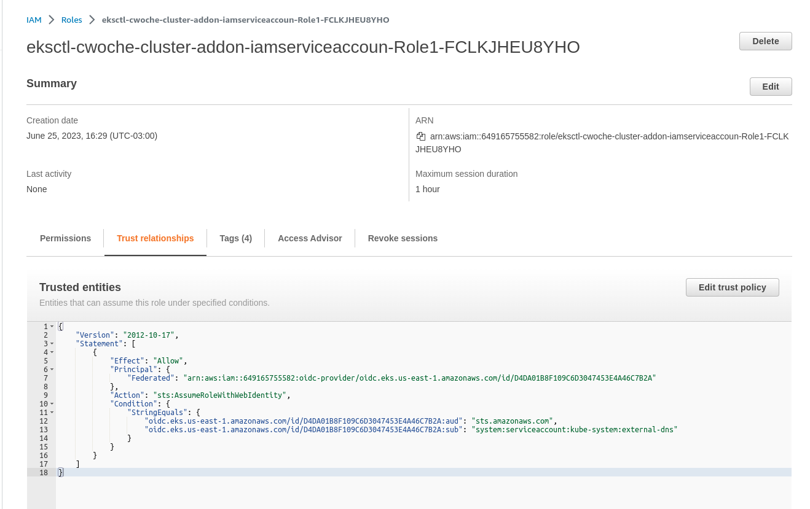
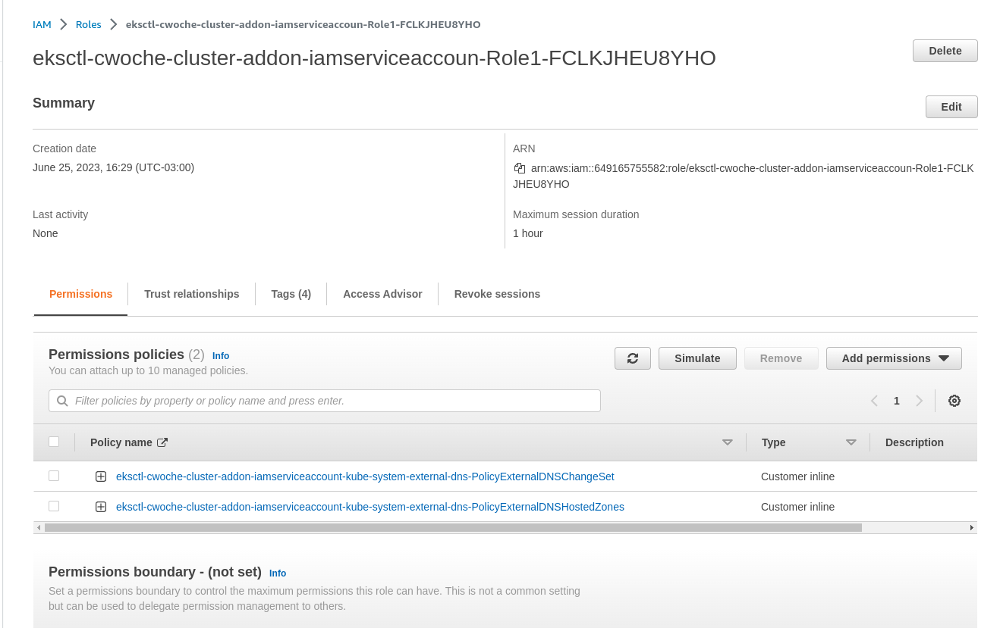
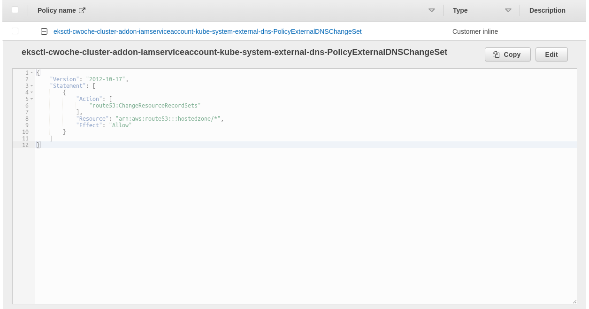
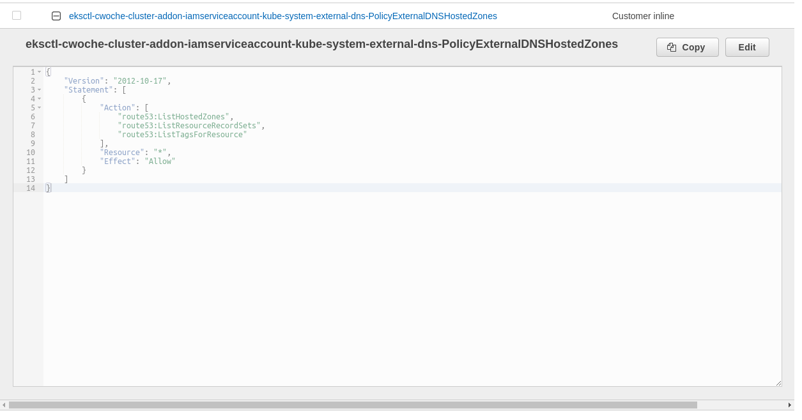

With EKS you can easily integrate K8S Service Accounts with IAM Roles.

You can define the Service Accounts along with the iam policies/roles in the cluster.yaml definition

Example of the external-dns service account

